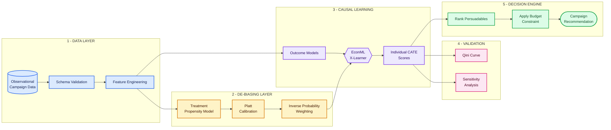

```mermaid
flowchart LR
    subgraph DATA["1 - DATA LAYER"]
        A[("Observational<br/>Campaign Data")]
        B["Schema Validation"]
        C["Feature Engineering"]
        A --> B --> C
    end

    subgraph DEBIAS["2 - DE-BIASING LAYER"]
        D["Treatment<br/>Propensity Model"]
        E["Platt<br/>Calibration"]
        F["Inverse Probability<br/>Weighting"]
        D --> E --> F
    end

    subgraph CAUSAL["3 - CAUSAL LEARNING"]
        G["Outcome Models"]
        H{{"EconML<br/>X-Learner"}}
        I["Individual CATE<br/>Scores"]
        G --> H --> I
    end

    subgraph VALIDATE["4 - VALIDATION"]
        J["Qini Curve"]
        K["Sensitivity<br/>Analysis"]
    end

    subgraph DECIDE["5 - DECISION ENGINE"]
        L["Rank Persuadables"]
        M["Apply Budget<br/>Constraint"]
        N(["Campaign<br/>Recommendation"])
        L --> M --> N
    end

    C --> D
    C --> G
    F --> H
    I --> J
    I --> K
    I --> L

    classDef data fill:#DBEAFE,stroke:#2563EB,color:#172554,stroke-width:2px
    classDef bias fill:#FEF3C7,stroke:#D97706,color:#451A03,stroke-width:2px
    classDef model fill:#EDE9FE,stroke:#7C3AED,color:#2E1065,stroke-width:2px
    classDef check fill:#FCE7F3,stroke:#DB2777,color:#500724,stroke-width:2px
    classDef action fill:#DCFCE7,stroke:#16A34A,color:#14532D,stroke-width:2px

    class A,B,C data
    class D,E,F bias
    class G,H,I model
    class J,K check
    class L,M,N action
```
